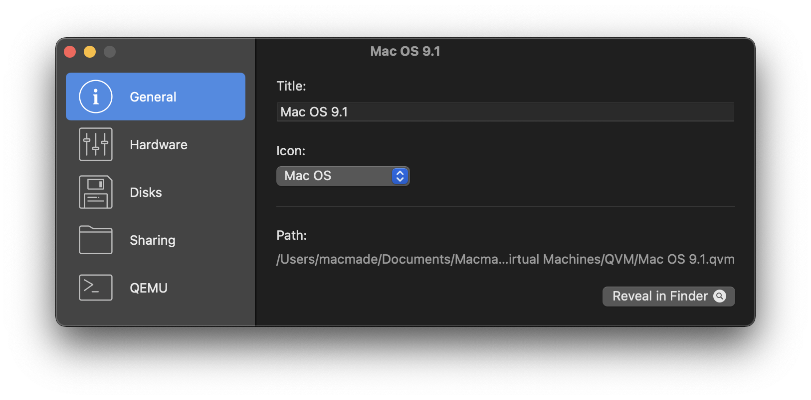
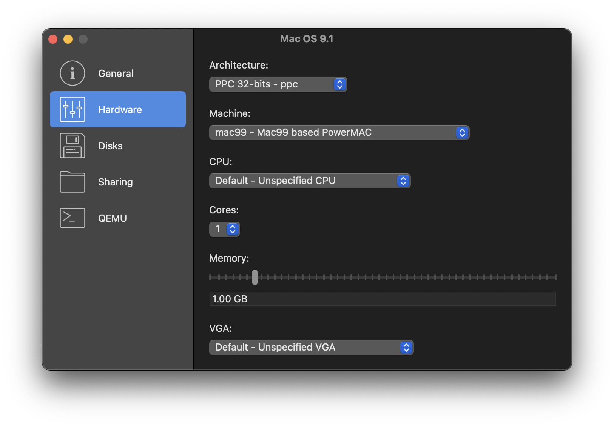
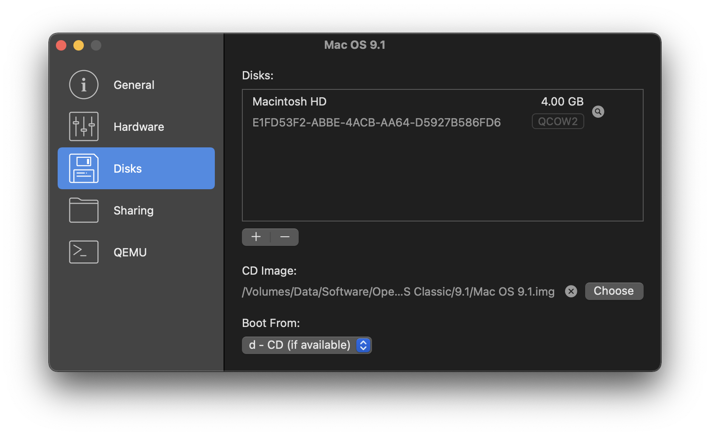
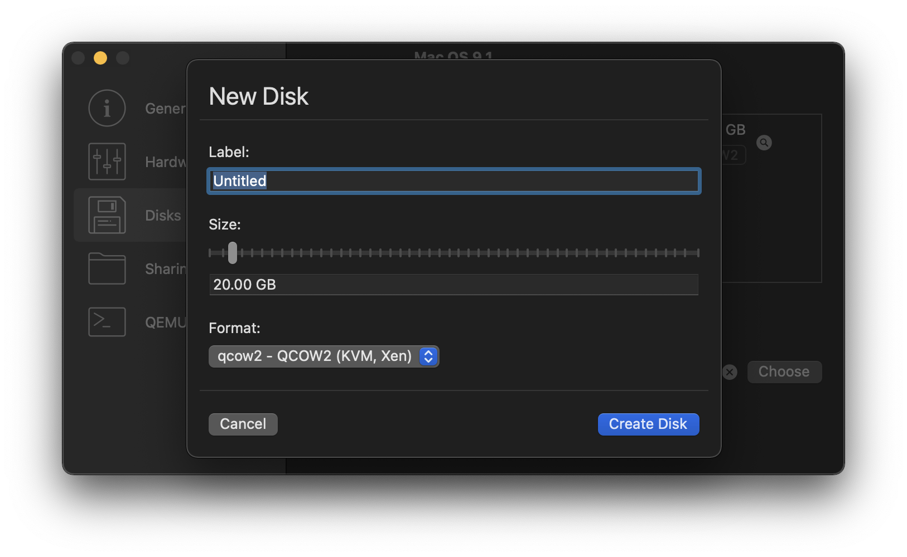
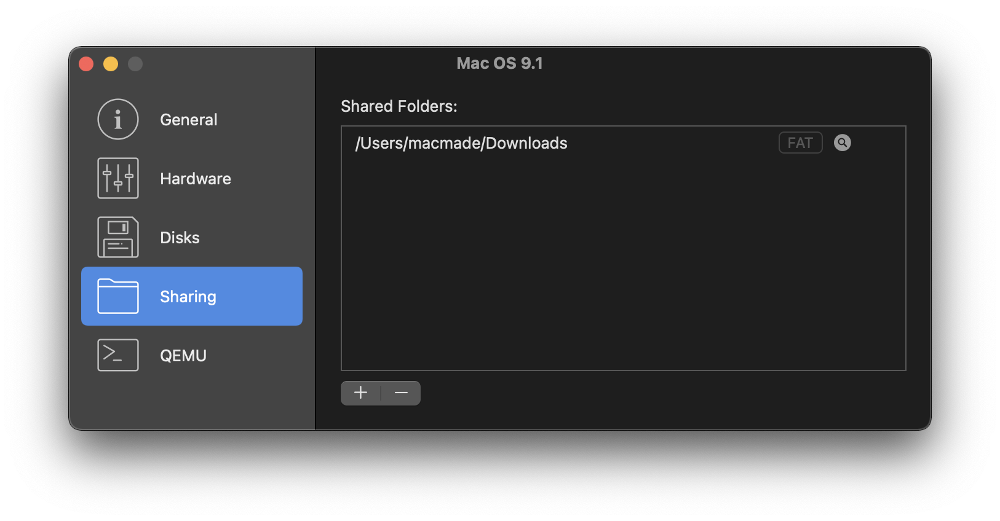
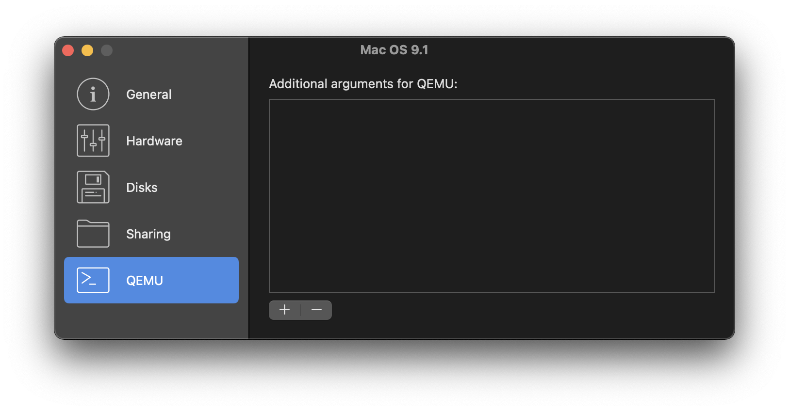

### **QEMU-Manager**

  
  

### About

This is a **modified version** of **[QEMU-Manager](https://github.com/macmade/QEMU-Manager)**, a macOS graphical frontend for [QEMU](https://www.qemu.org), originally created by **Jean-David Gadina - XS-Labs**.  

This version includes custom modifications and enhancements.

---

### **Screenshots**

#### General Configuration  
  

#### Hardware Configuration  
  

#### Disks Configuration  
  
  

#### Sharing Configuration  
  

#### QEMU Configuration  
  

---

### License

This project is released under the **GNU General Public License (GPLv3)**.  
Since this is a modified version, it remains under **GPLv3** as per the original licensing terms.

---

### **Credits & Original Repository**

This project is based on **[QEMU-Manager](https://github.com/macmade/QEMU-Manager)**, originally developed by **Jean-David Gadina - XS-Labs**.  
For the original project, visit: [https://github.com/macmade/QEMU-Manager](https://github.com/macmade/QEMU-Manager).

---

### Repository Infos

| **Original Author** | **Modified by** |
|---------------------|----------------|
| Jean-David Gadina - XS-Labs | Your Name |
| **Website**: [www.xs-labs.com](https://www.xs-labs.com) | **Website**: Your Website (if applicable) |
| **Twitter**: [@macmade](https://twitter.com/macmade) | **GitHub**: Your GitHub |
| **GitHub**: [github.com/macmade](https://github.com/macmade) | **LinkedIn**: Your LinkedIn (if applicable) |

---

This README **properly attributes** the original author while making it clear that this is a **modified version**. Let me know if you need further adjustments! 🚀
