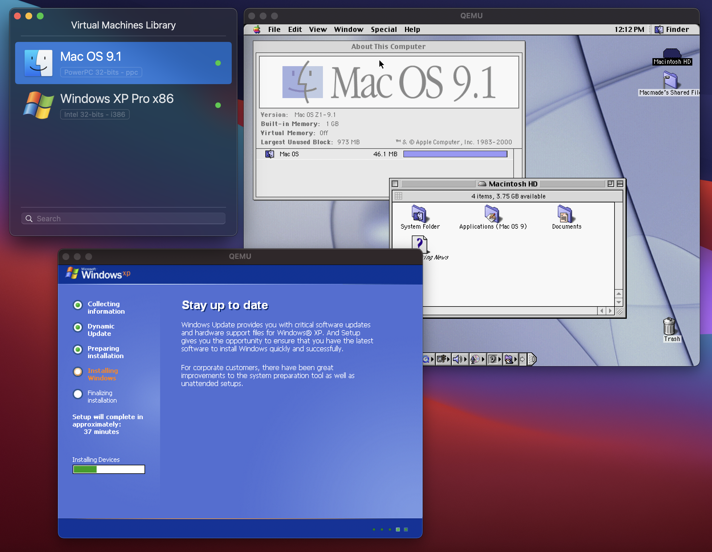

# QEMU Manager

A modern and adventurous re-imagining of a macOS frontend for [QEMU](https://www.qemu.org), originally created by **Jean-David Gadina (XS-Labs)**.
This project is designed for users familiar with virtualization, emulation, and QEMU’s extensive feature set.
The UI has been refreshed, but the tool proudly remains **power-user oriented**. ⚙️

---

## 🚀 Why This Rework?

* **Fresh Codebase:** Deprecated or redundant pieces have been removed and replaced with clean, modern Swift.
* **Feature-Rich:** Hypervisor Framework integration, UEFI boot, USB, advanced networking, and more.
* **Broad Architecture Support:** From classic m68k Mac systems to Windows 11 ARM—ideal for both retro-computing enthusiasts and cutting-edge testers.
* **Enhanced UI:** Smoother and more intuitive while still relying on Cocoa. Not fully HIG-compliant, but far more pleasant to use.
* **Bundled QEMU:** No system-wide installation required—comes with an up-to-date QEMU ready to run out-of-the-box. 📦

---

## ⚠️ Quick Heads-Up

* **Steep Learning Curve:** New to QEMU? Expect complexity. This app favors transparency over abstraction.
* **Evolving UI:** Improved, but still in active refinement. Feedback is welcome! 💬

---

## 📄 License

Released under the **GNU General Public License (GPLv3)**, preserving the project’s original licensing terms.

---

## 🙏 Credits & Original Repo

* Original author: **Jean-David Gadina (XS-Labs)**
* Source project:
  👉 [QEMU-Manager on GitHub](https://github.com/macmade/QEMU-Manager)
